### Rahul Kumar Verma
full stack developer · mern · react native

[rahulverma.site](https://www.rahulverma.site) · [linkedin](https://linkedin.com/in/devrahuljourney) · [twitter](https://twitter.com/devrahuljourney) · [leetcode](https://leetcode.com/devrahuljourney) · devrahulverma9162@gmail.com

---

### VS Code Extension

**[React Native Style Injector](https://marketplace.visualstudio.com/items?itemName=rahul-dev.rn-style-injector)** — used by **350+ developers**. auto-injects missing styles into `StyleSheet.create`. trigger with `Alt+S`. no setup needed.

---

### Projects

---

### Stats

---

### Streak

---

### Technical Skills

**Languages**

**Frameworks & Libraries**

**Databases & Tools**

**Coursework** — `OOPs` `Operating Systems` `Computer Networks` `DBMS`

---

### Activity

---

### Contribution Snake

<picture>
  <source media="(prefers-color-scheme: dark)" srcset="https://raw.githubusercontent.com/devrahuljourney/devrahuljourney/output/github-snake-dark.svg" />
  <source media="(prefers-color-scheme: light)" srcset="https://raw.githubusercontent.com/devrahuljourney/devrahuljourney/output/github-snake.svg" />
  
</picture>

